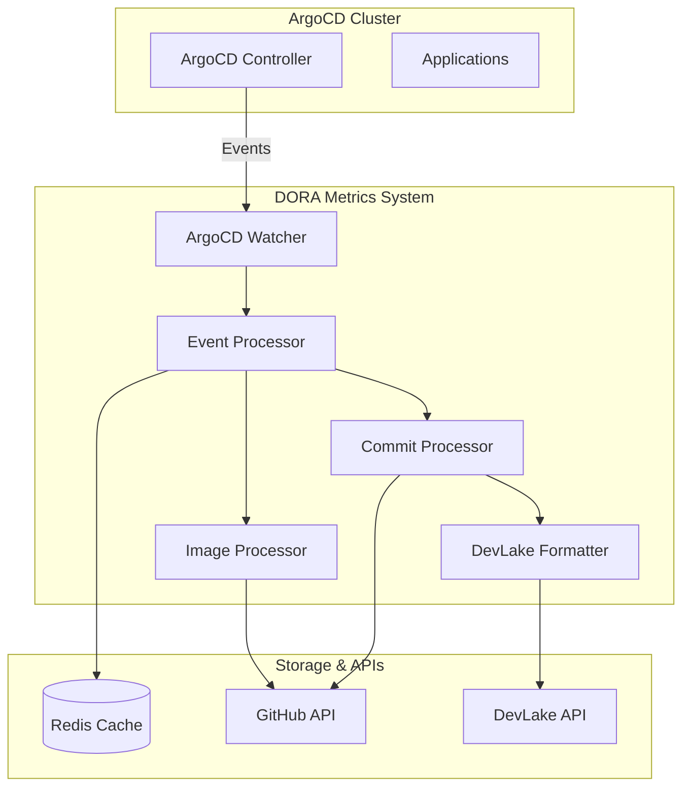

# DORA Metrics Documentation

This directory contains comprehensive documentation for the DORA Metrics system that monitors ArgoCD deployments and sends deployment data to DevLake for DORA metrics collection and analysis.

## 📚 Documentation Overview

### Core Documentation

| Document | Description | Key Topics |
|----------|-------------|------------|
| [**Architecture**](architecture.md) | Complete system architecture and design | Components, data flow, DORA metrics, configuration |
| [**Data Flow**](data-flow.md) | Detailed data flow diagrams and processes | Event processing, commit handling, DevLake integration |
| [**Deployment Guide**](deployment-guide.md) | Step-by-step deployment instructions | Kubernetes manifests, configuration, monitoring |

## 🏗️ System Architecture

The DORA Metrics system consists of several key components working together to monitor ArgoCD deployments and send data to DevLake:



## 🔄 Data Flow

### Successful Deployment Flow

1. **ArgoCD Event**: Application status changes to `Synced`
2. **Event Detection**: Watcher detects `MODIFIED` event
3. **Deployment Validation**: Event processor checks if it's a new deployment
4. **Image Processing**: Extract and validate Docker image tags
5. **Commit Processing**: Retrieve commit history from GitHub
6. **DevLake Formatting**: Format data for DevLake API
7. **Data Transmission**: Send deployment data to DevLake
8. **Caching**: Store deployment record in Redis

### Failed Deployment Flow

1. **ArgoCD Event**: Application status becomes `OutOfSync` + `Missing`
2. **Failure Detection**: Event processor identifies failed deployment
3. **Commit Retrieval**: Get commit data for failed deployment
4. **Failure Formatting**: Format as `FAILED` deployment
5. **DevLake Transmission**: Send failed deployment to DevLake
6. **Caching**: Mark as processed until recovery

## 📊 DORA Metrics Tracked

The system tracks all four DORA metrics:

| Metric | Description | Data Source | Calculation |
|--------|-------------|-------------|-------------|
| **Deployment Frequency** | How often deployments occur | ArgoCD events | Count per day |
| **Lead Time for Changes** | Time from commit to deployment | Commit dates | `deployment.finishedDate - commit.createdAt` |
| **Change Failure Rate** | Percentage of failed deployments | Failed events | `failed_deployments / total_deployments * 100` |
| **Mean Time to Recovery** | Time to recover from failures | Recovery events | `recovery_time - failure_time` |

## 🚀 Quick Start

### Prerequisites

- Kubernetes cluster with ArgoCD
- Redis instance
- GitHub API access
- DevLake instance

### Installation

1. **Deploy Redis**:
   ```bash
   kubectl apply -f deployment-guide.md#redis-manifest
   ```

2. **Configure DORA Metrics**:
   ```bash
   kubectl apply -f deployment-guide.md#config-manifest
   ```

3. **Deploy DORA Metrics**:
   ```bash
   kubectl apply -f deployment-guide.md#dora-metrics-manifest
   ```

4. **Verify Deployment**:
   ```bash
   kubectl get pods -l app=dora-metrics
   kubectl logs -f deployment/dora-metrics
   ```

## 🔧 Configuration

### Key Configuration Options

```yaml
argocd:
  enabled: true
  namespaces: ["argocd", "openshift-gitops"]
  componentsToMonitor: ["konflux-ui", "konflux-api"]
  knownClusters: ["production", "staging"]

integration:
  devlake:
    enabled: true
    baseURL: "https://devlake.example.com"
    projectID: "12345"
    timeoutSeconds: 30

storage:
  redis:
    host: "redis"
    port: 6379
    password: ""
    db: 0
```

## 📈 Monitoring

### Key Metrics to Monitor

- **Deployment Rate**: `rate(dora_deployments_total[1h])`
- **Success Rate**: `rate(dora_deployments_success_total[1h]) / rate(dora_deployments_total[1h])`
- **Lead Time**: `histogram_quantile(0.95, rate(dora_lead_time_seconds_bucket[1h]))`
- **Error Rate**: `rate(dora_errors_total[1h])`

### Grafana Dashboard

Import the provided Grafana dashboard configuration to visualize DORA metrics in real-time.

## 🐛 Troubleshooting

### Common Issues

1. **No Deployments Processed**
   - Check ArgoCD application status
   - Verify namespace configuration
   - Check component filter settings

2. **Missing Commit Data**
   - Verify GitHub API token
   - Check repository access permissions
   - Validate commit SHA format

3. **DevLake Integration Failures**
   - Verify DevLake API URL and project ID
   - Check network connectivity
   - Validate payload format

### Debug Commands

```bash
# Check application status
kubectl get applications -n argocd

# View DORA Metrics logs
kubectl logs -f deployment/dora-metrics

# Test Redis connectivity
kubectl exec -it deployment/redis -- redis-cli ping

# Test GitHub API access
kubectl exec -it deployment/dora-metrics -- curl -H "Authorization: token $GITHUB_TOKEN" https://api.github.com/user

# Test DevLake API
kubectl exec -it deployment/dora-metrics -- curl -X GET "$DEVLAKE_URL/api/v1/projects/$PROJECT_ID"
```

## 🔒 Security

### Security Considerations

- **API Authentication**: GitHub and DevLake use token-based authentication
- **Network Security**: All communication uses HTTPS
- **RBAC**: Kubernetes RBAC controls access to ArgoCD resources
- **Data Privacy**: Only commit metadata is stored, no source code

### Security Best Practices

- Use dedicated service accounts with minimal permissions
- Rotate API tokens regularly
- Enable network policies for pod-to-pod communication
- Use secrets for sensitive configuration data

## 📋 File Structure

```
docs/
├── README.md                 # This overview document
├── architecture.md          # Complete system architecture
├── data-flow.md            # Detailed data flow diagrams
└── deployment-guide.md     # Deployment and configuration guide
```

## 🤝 Contributing

When contributing to the DORA Metrics system:

1. Update relevant documentation
2. Add diagrams for new features
3. Update troubleshooting guides
4. Test configuration changes
5. Update monitoring dashboards

## 📞 Support

For issues and questions:

1. Check the troubleshooting section
2. Review the logs for error messages
3. Verify configuration settings
4. Test external API connectivity
5. Check Kubernetes resource status

## 📝 License

This documentation is part of the DORA Metrics project and follows the same license terms.

