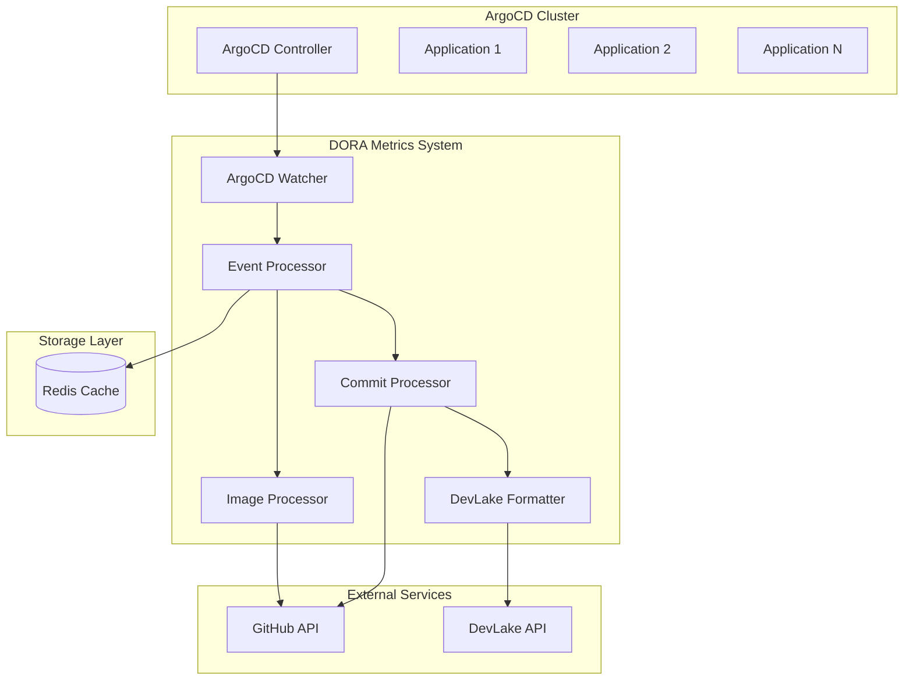
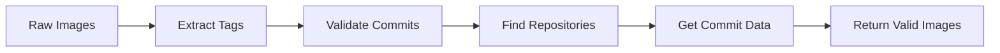
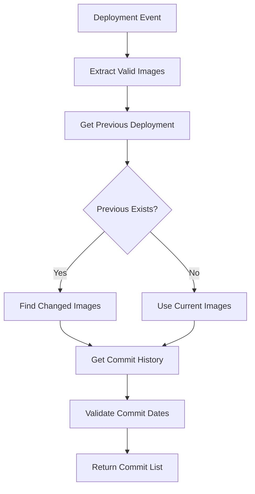
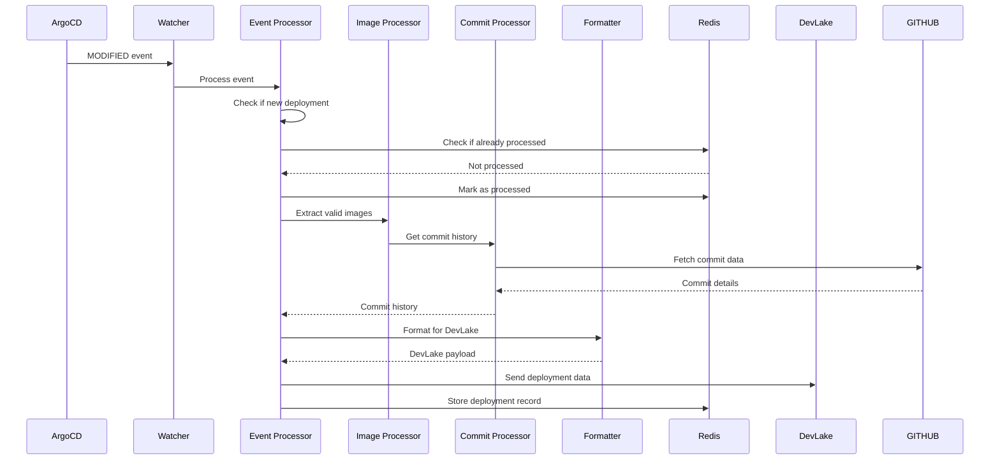
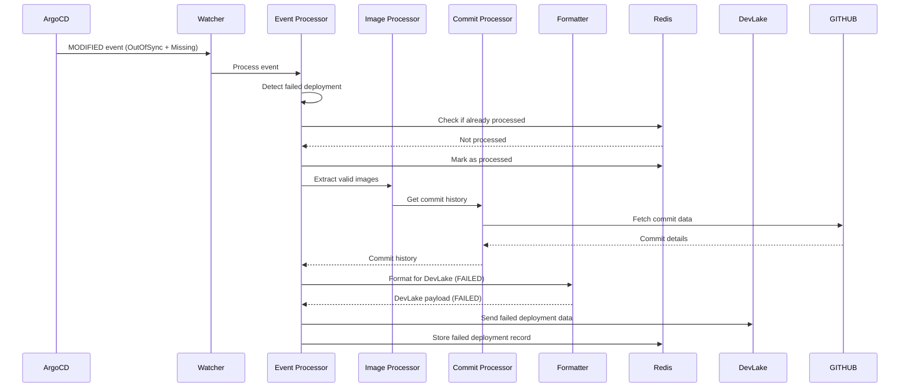

# DORA Metrics Architecture: ArgoCD to DevLake Integration

## Overview

This document describes the architecture of the DORA Metrics system that monitors ArgoCD deployments and sends deployment data to DevLake for DORA metrics collection and analysis.

## System Architecture

### High-Level Architecture



## Component Details

### 1. ArgoCD Watcher (`api/watcher.go`)

**Purpose**: Monitors ArgoCD applications for deployment events

**Key Features**:
- Watches for `MODIFIED` events on ArgoCD applications
- Filters applications based on configured namespaces and components
- Handles application lifecycle events

**Event Types**:
- `ADDED`: New application created (ignored)
- `MODIFIED`: Application updated (processed)
- `DELETED`: Application deleted (logged)

### 2. Event Processor (`processor/event.go`)

**Purpose**: Core business logic for processing ArgoCD events

**Key Functions**:
- `HandleEvent()`: Main entry point for event processing
- `handleModifiedEvent()`: Processes deployment events
- `processNewDeployment()`: Handles successful deployments
- `processFailedDeployment()`: Handles failed deployments

**Deployment Detection Logic**:
```go
// New deployment is detected when:
syncRevision == lastHistoryRevision

// Failed deployment is detected when:
syncStatus == "OutOfSync" && healthStatus == "Missing"
```

### 3. Image Processor (`processor/images.go`)

**Purpose**: Handles Docker image processing and validation

**Key Functions**:
- `ExtractValidImages()`: Validates image tags as commit hashes
- `FindChangedImages()`: Identifies changed images between deployments
- `GetCommitHistoryForImage()`: Retrieves commit history for specific images

**Image Processing Flow**:


### 4. Commit Processor (`processor/commits.go`)

**Purpose**: Manages commit history retrieval and processing

**Key Functions**:
- `GetCommitHistoryForDeployment()`: Main commit retrieval function
- `createCommitsFromImages()`: Creates commits from current images
- `getCommitHistoryForChangedImages()`: Gets history for changed images

**Commit Processing Flow**:


### 5. DevLake Formatter (`parser/formatter.go`)

**Purpose**: Formats deployment data for DevLake API

**Key Functions**:
- `FormatDeployment()`: Creates DevLake-compatible deployment payload
- `createDevLakeCommits()`: Formats commit data for DevLake
- `determineResult()`: Determines deployment result (SUCCESS/FAILED)

**DevLake Payload Structure**:
```json
{
  "id": "commit-sha",
  "createdDate": "2025-09-19T22:00:00Z",
  "startedDate": "2025-09-19T21:30:00Z",
  "finishedDate": "2025-09-19T22:00:00Z",
  "environment": "PRODUCTION",
  "result": "SUCCESS",
  "displayTitle": "Production Deployment component: app-name, revision abc123 (2025-09-19 22:00:00 MST)",
  "name": "deploy to production abc123",
  "deploymentCommits": [
    {
      "repoUrl": "https://github.com/org/repo",
      "refName": "abc123",
      "startedDate": "2025-09-19T21:30:00Z",
      "finishedDate": "2025-09-19T22:00:00Z",
      "commitSha": "abc123",
      "commitMsg": "feat: add new feature",
      "result": "SUCCESS",
      "displayTitle": "feat: add new feature",
      "name": "feat: add new feature"
    }
  ]
}
```

## Data Flow

### Successful Deployment Flow



### Failed Deployment Flow



## Configuration

### ArgoCD Configuration

```yaml
argocd:
  enabled: true
  namespaces:
    - "argocd"
    - "openshift-gitops"
  componentsToIgnore: []
  # List components to exclude from monitoring (all others will be monitored)
  # Example: ["test-component", "deprecated-service"]
  knownClusters:
    - "production"
    - "staging"
```

### DevLake Configuration

```yaml
integration:
  devlake:
    enabled: true
    baseURL: "https://devlake.example.com"
    projectID: "12345"
    timeoutSeconds: 30
```

### Storage Configuration

```yaml
storage:
  redis:
    host: "localhost"
    port: 6379
    password: ""
    db: 0
```

## DORA Metrics

The system tracks the following DORA metrics:

### 1. Deployment Frequency
- **Metric**: Number of deployments per day
- **Data Source**: ArgoCD deployment events
- **Calculation**: Count of successful deployments per day

### 2. Lead Time for Changes
- **Metric**: Time from commit to deployment
- **Data Source**: Commit creation date vs deployment date
- **Calculation**: `deployment.finishedDate - commit.createdAt`

### 3. Change Failure Rate
- **Metric**: Percentage of deployments that fail
- **Data Source**: Failed deployment events
- **Calculation**: `failed_deployments / total_deployments * 100`

### 4. Mean Time to Recovery (MTTR)
- **Metric**: Average time to recover from failures
- **Data Source**: Failed deployment to recovery time
- **Calculation**: `recovery_time - failure_time`

## Error Handling

### Retry Logic
- Failed API calls to GitHub are retried with exponential backoff
- Redis connection failures are handled gracefully
- DevLake API failures are logged but don't stop processing

### Fallback Mechanisms
- If commit date cannot be retrieved, deployment is skipped
- If repository cannot be found, falls back to infra-deployments
- If no valid images found, still processes infra-deployments commit

### Logging
- All operations are logged with appropriate levels
- DevLake payloads are logged as single JSON entries
- Error conditions are logged with context

## Monitoring and Observability

### Key Metrics to Monitor
- Number of deployments processed per hour
- Number of failed deployments
- API response times (GitHub, DevLake)
- Redis connection health
- Memory usage and CPU utilization

### Alerts
- High failure rate (>10% in 1 hour)
- API timeouts or errors
- Redis connection failures
- Memory usage >80%

## Security Considerations

### API Authentication
- GitHub API uses personal access tokens
- DevLake API uses project-based authentication
- Redis uses password authentication

### Data Privacy
- Only commit SHAs and metadata are stored
- No source code content is accessed
- All data is stored in encrypted Redis instance

### Network Security
- All API calls use HTTPS
- Internal communication uses secure channels
- Firewall rules restrict access to necessary ports

## Scalability

### Horizontal Scaling
- Multiple instances can run in parallel
- Redis provides shared state management
- Each instance processes different namespaces

### Performance Optimization
- Commit processing is cached per component
- Image validation is cached per commit
- Batch processing for multiple deployments

### Resource Requirements
- **CPU**: 100m per instance
- **Memory**: 256Mi per instance
- **Storage**: 1Gi for Redis
- **Network**: 1Mbps for API calls

## Troubleshooting

### Common Issues

1. **No deployments being processed**
   - Check ArgoCD application status
   - Verify namespace configuration
   - Check component filter settings

2. **Missing commit data**
   - Verify GitHub API token
   - Check repository access permissions
   - Validate commit SHA format

3. **DevLake integration failures**
   - Verify DevLake API URL and project ID
   - Check network connectivity
   - Validate payload format

### Debug Commands

```bash
# Check Redis connectivity
redis-cli ping

# View recent deployments
redis-cli keys "deployment:*"

# Check GitHub API access
curl -H "Authorization: token $GITHUB_TOKEN" https://api.github.com/user

# Test DevLake API
curl -X POST "$DEVLAKE_URL/api/v1/projects/$PROJECT_ID/deployments" \
  -H "Content-Type: application/json" \
  -d '{"test": "data"}'
```

## Future Enhancements

### Planned Features
- Support for multiple ArgoCD instances
- Integration with other CI/CD systems
- Advanced filtering and routing
- Real-time dashboards
- Custom metric definitions

### Performance Improvements
- Parallel processing of deployments
- Streaming data to DevLake
- Advanced caching strategies
- Database optimization

## Conclusion

The DORA Metrics system provides a robust, scalable solution for tracking deployment metrics from ArgoCD to DevLake. The modular architecture ensures maintainability and extensibility while providing comprehensive DORA metrics for DevOps teams.

The system handles both successful and failed deployments, provides detailed commit information, and integrates seamlessly with existing ArgoCD and DevLake infrastructure.

