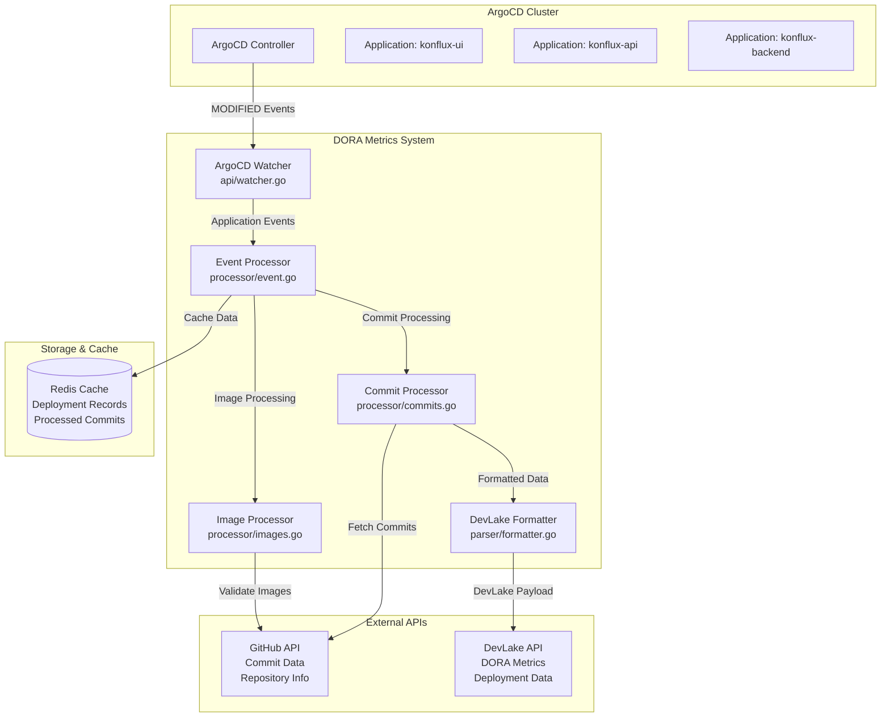
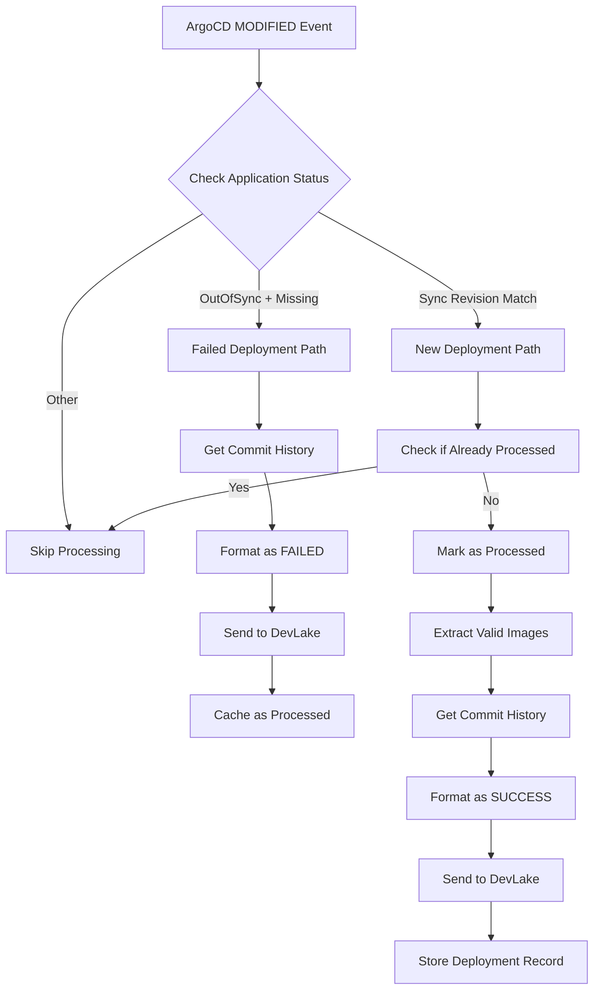
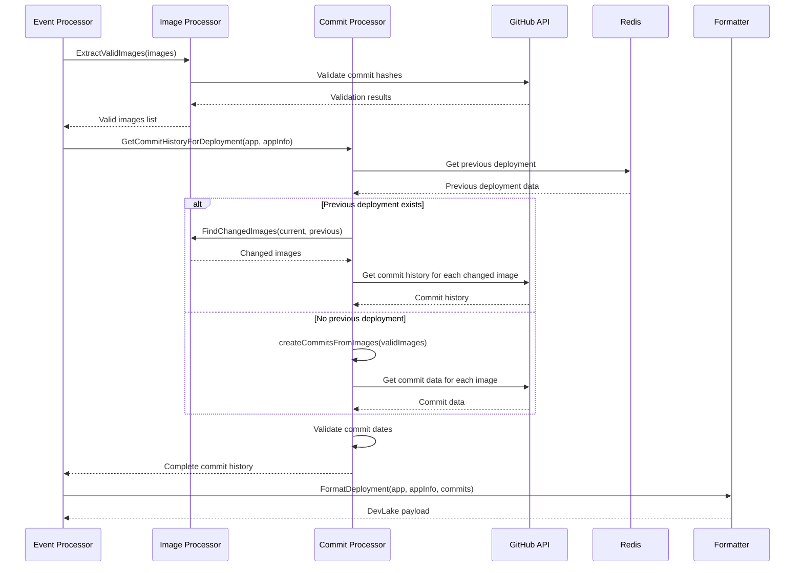
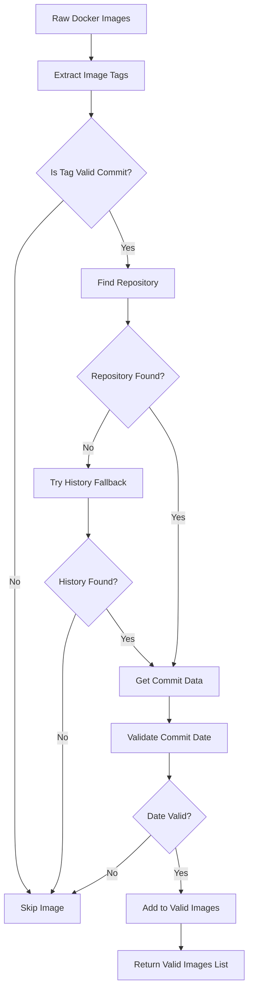
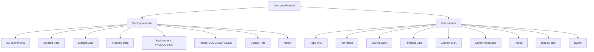
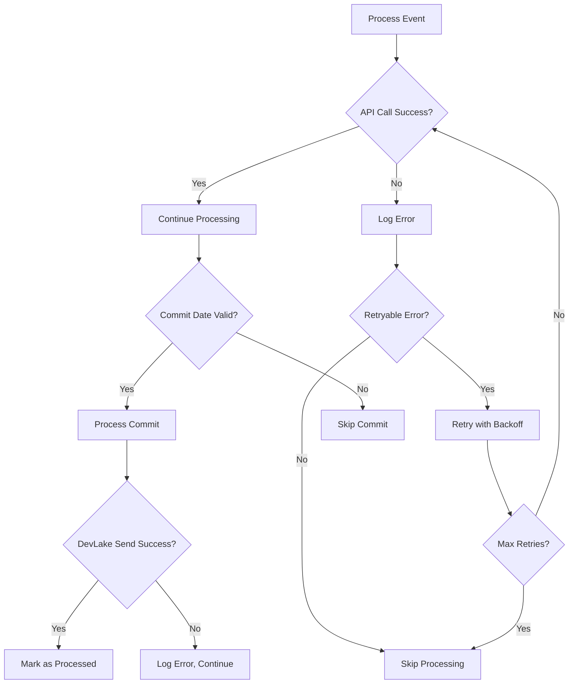
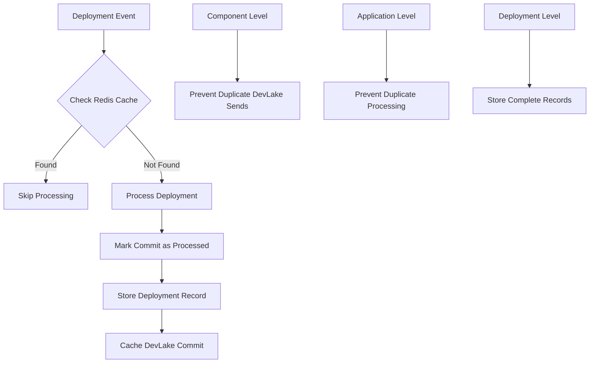
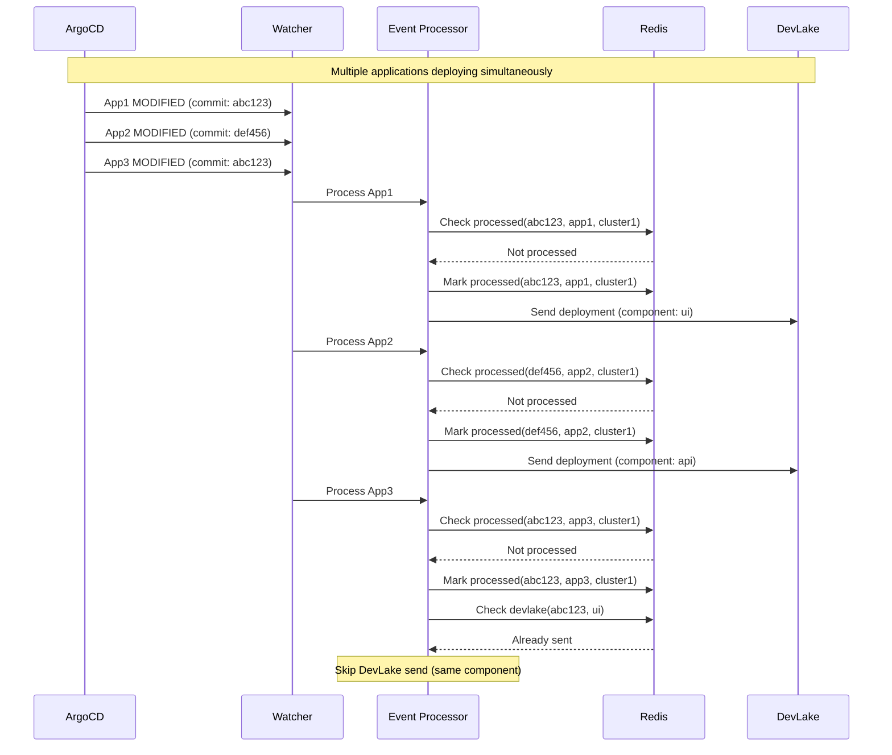
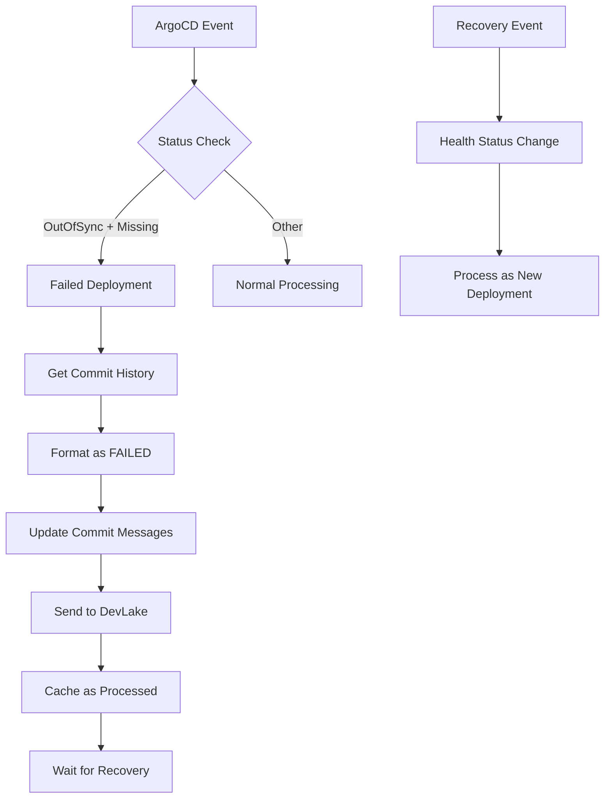
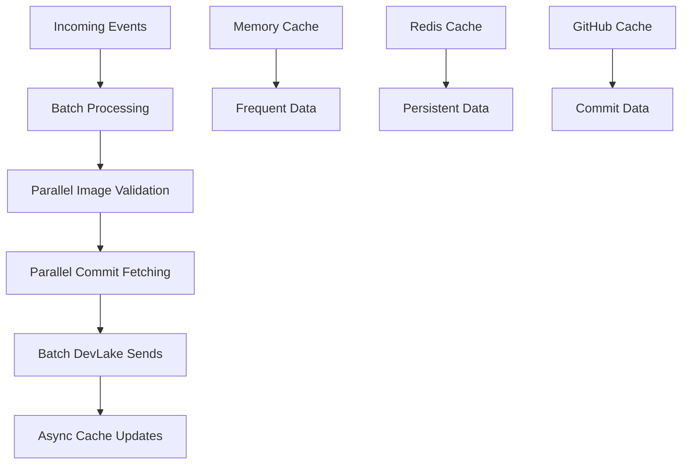

# Data Flow Diagrams

## 1. System Overview

## 2. Deployment Processing Flow

## 3. Commit Processing Detail

## 4. Image Processing Detail

## 5. DevLake Payload Structure

## 6. Error Handling Flow

## 7. Caching Strategy

## 8. Multi-Application Deployment

## 9. Failed Deployment Handling

## 10. Performance Optimization

This comprehensive data flow documentation shows how the DORA Metrics system processes ArgoCD deployments and sends them to DevLake, with detailed diagrams for each major component and process flow.

