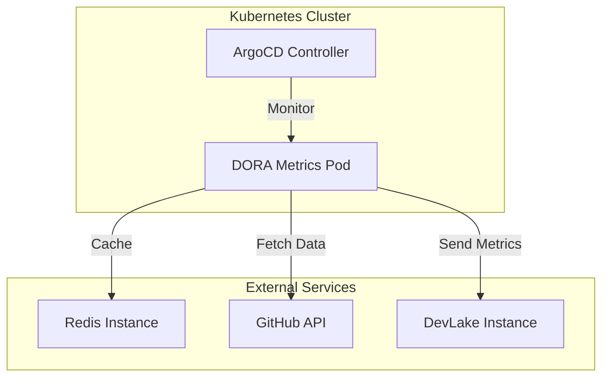
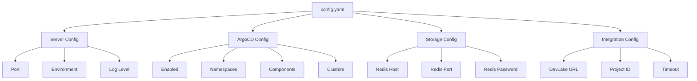
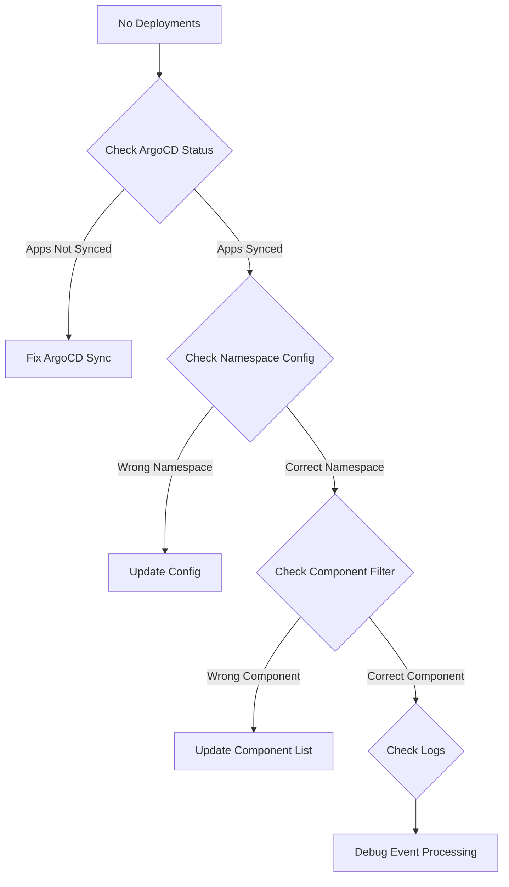

# Deployment Guide

## Prerequisites

### Required Services



### System Requirements

| Component | CPU | Memory | Storage | Network |
|-----------|-----|--------|---------|---------|
| DORA Metrics | 100m | 256Mi | - | 1Mbps |
| Redis | 50m | 128Mi | 1Gi | 100Kbps |
| ArgoCD | 200m | 512Mi | 10Gi | 1Mbps |

## Installation Steps

### 1. Deploy Redis

```yaml
apiVersion: apps/v1
kind: Deployment
metadata:
  name: redis
spec:
  replicas: 1
  selector:
    matchLabels:
      app: redis
  template:
    metadata:
      labels:
        app: redis
    spec:
      containers:
      - name: redis
        image: redis:7-alpine
        ports:
        - containerPort: 6379
        resources:
          requests:
            cpu: 50m
            memory: 128Mi
          limits:
            cpu: 100m
            memory: 256Mi
---
apiVersion: v1
kind: Service
metadata:
  name: redis
spec:
  selector:
    app: redis
  ports:
  - port: 6379
    targetPort: 6379
```

### 2. Configure DORA Metrics

```yaml
apiVersion: v1
kind: ConfigMap
metadata:
  name: dora-metrics-config
data:
  config.yaml: |
    server:
      port: "8080"
      environment: "production"
      logLevel: "info"
    
    argocd:
      enabled: true
      namespaces:
        - "argocd"
        - "openshift-gitops"
      componentsToIgnore: []
      # List components to exclude from monitoring (all others will be monitored)
      # Example: ["test-component", "deprecated-service"]
      knownClusters:
        - "production"
        - "staging"
    
    storage:
      redis:
        host: "redis"
        port: 6379
        password: ""
        db: 0
    
    integration:
      devlake:
        enabled: true
        baseURL: "https://devlake.example.com"
        projectID: "12345"
        timeoutSeconds: 30
```

### 3. Deploy DORA Metrics

```yaml
apiVersion: apps/v1
kind: Deployment
metadata:
  name: dora-metrics
spec:
  replicas: 2
  selector:
    matchLabels:
      app: dora-metrics
  template:
    metadata:
      labels:
        app: dora-metrics
    spec:
      serviceAccountName: dora-metrics
      containers:
      - name: dora-metrics
        image: dora-metrics:latest
        ports:
        - containerPort: 8080
        env:
        - name: GITHUB_TOKEN
          valueFrom:
            secretKeyRef:
              name: github-secret
              key: token
        - name: DEVLAKE_TOKEN
          valueFrom:
            secretKeyRef:
              name: devlake-secret
              key: token
        volumeMounts:
        - name: config
          mountPath: /app/configs
        resources:
          requests:
            cpu: 100m
            memory: 256Mi
          limits:
            cpu: 200m
            memory: 512Mi
        livenessProbe:
          httpGet:
            path: /health
            port: 8080
          initialDelaySeconds: 30
          periodSeconds: 10
        readinessProbe:
          httpGet:
            path: /health
            port: 8080
          initialDelaySeconds: 5
          periodSeconds: 5
      volumes:
      - name: config
        configMap:
          name: dora-metrics-config
---
apiVersion: v1
kind: Service
metadata:
  name: dora-metrics
spec:
  selector:
    app: dora-metrics
  ports:
  - port: 8080
    targetPort: 8080
  type: ClusterIP
```

### 4. Create RBAC Permissions

```yaml
apiVersion: v1
kind: ServiceAccount
metadata:
  name: dora-metrics
  namespace: argocd
---
apiVersion: rbac.authorization.k8s.io/v1
kind: ClusterRole
metadata:
  name: dora-metrics
rules:
- apiGroups: ["argoproj.io"]
  resources: ["applications"]
  verbs: ["get", "list", "watch"]
- apiGroups: [""]
  resources: ["pods", "services", "endpoints"]
  verbs: ["get", "list", "watch"]
---
apiVersion: rbac.authorization.k8s.io/v1
kind: ClusterRoleBinding
metadata:
  name: dora-metrics
roleRef:
  apiGroup: rbac.authorization.k8s.io
  kind: ClusterRole
  name: dora-metrics
subjects:
- kind: ServiceAccount
  name: dora-metrics
  namespace: argocd
```

## Configuration

### Environment Variables

```bash
# GitHub Configuration
GITHUB_TOKEN=ghp_xxxxxxxxxxxxxxxxxxxx

# DevLake Configuration
DEVLAKE_URL=https://devlake.example.com
DEVLAKE_PROJECT_ID=12345
DEVLAKE_TOKEN=your-devlake-token

# Redis Configuration
REDIS_HOST=redis
REDIS_PORT=6379
REDIS_PASSWORD=your-redis-password

# Server Configuration
PORT=8080
ENVIRONMENT=production
LOG_LEVEL=info
```

### Configuration File Structure



## Monitoring Setup

### 1. Prometheus Metrics

```yaml
apiVersion: v1
kind: ServiceMonitor
metadata:
  name: dora-metrics
  labels:
    app: dora-metrics
spec:
  selector:
    matchLabels:
      app: dora-metrics
  endpoints:
  - port: 8080
    path: /metrics
    interval: 30s
```

### 2. Grafana Dashboard

```json
{
  "dashboard": {
    "title": "DORA Metrics Dashboard",
    "panels": [
      {
        "title": "Deployments per Hour",
        "type": "graph",
        "targets": [
          {
            "expr": "rate(dora_deployments_total[1h])",
            "legendFormat": "Deployments/hour"
          }
        ]
      },
      {
        "title": "Deployment Success Rate",
        "type": "stat",
        "targets": [
          {
            "expr": "rate(dora_deployments_success_total[1h]) / rate(dora_deployments_total[1h]) * 100",
            "legendFormat": "Success Rate %"
          }
        ]
      },
      {
        "title": "Average Lead Time",
        "type": "graph",
        "targets": [
          {
            "expr": "histogram_quantile(0.95, rate(dora_lead_time_seconds_bucket[1h]))",
            "legendFormat": "95th percentile"
          }
        ]
      }
    ]
  }
}
```

### 3. Alerting Rules

```yaml
apiVersion: monitoring.coreos.com/v1
kind: PrometheusRule
metadata:
  name: dora-metrics-alerts
spec:
  groups:
  - name: dora-metrics
    rules:
    - alert: HighFailureRate
      expr: rate(dora_deployments_failed_total[1h]) / rate(dora_deployments_total[1h]) > 0.1
      for: 5m
      labels:
        severity: warning
      annotations:
        summary: "High deployment failure rate detected"
        description: "Deployment failure rate is {{ $value | humanizePercentage }}"
    
    - alert: NoDeployments
      expr: rate(dora_deployments_total[1h]) == 0
      for: 10m
      labels:
        severity: critical
      annotations:
        summary: "No deployments detected"
        description: "No deployments have been processed in the last hour"
    
    - alert: DevLakeIntegrationDown
      expr: up{job="dora-metrics"} == 0
      for: 1m
      labels:
        severity: critical
      annotations:
        summary: "DORA Metrics service is down"
        description: "DORA Metrics service has been down for more than 1 minute"
```

## Troubleshooting

### Common Issues and Solutions

#### 1. No Deployments Being Processed



**Debug Commands:**
```bash
# Check ArgoCD applications
kubectl get applications -n argocd

# Check DORA Metrics logs
kubectl logs -f deployment/dora-metrics

# Check Redis connectivity
kubectl exec -it deployment/redis -- redis-cli ping

# Check GitHub API access
kubectl exec -it deployment/dora-metrics -- curl -H "Authorization: token $GITHUB_TOKEN" https://api.github.com/user
```

#### 2. Missing Commit Data

**Symptoms:**
- Deployments processed but no commit information
- "CRITICAL: Could not get commit date" errors

**Solutions:**
```bash
# Verify GitHub token permissions
kubectl exec -it deployment/dora-metrics -- curl -H "Authorization: token $GITHUB_TOKEN" https://api.github.com/user

# Check repository access
kubectl exec -it deployment/dora-metrics -- curl -H "Authorization: token $GITHUB_TOKEN" https://api.github.com/repos/org/repo

# Validate commit SHA format
kubectl exec -it deployment/dora-metrics -- curl -H "Authorization: token $GITHUB_TOKEN" https://api.github.com/repos/org/repo/commits/abc123
```

#### 3. DevLake Integration Failures

**Symptoms:**
- Deployments processed but not appearing in DevLake
- "Failed to send to DevLake" errors

**Solutions:**
```bash
# Test DevLake connectivity
kubectl exec -it deployment/dora-metrics -- curl -X GET "$DEVLAKE_URL/api/v1/projects/$PROJECT_ID"

# Check DevLake project configuration
kubectl exec -it deployment/dora-metrics -- curl -X POST "$DEVLAKE_URL/api/v1/projects/$PROJECT_ID/deployments" \
  -H "Content-Type: application/json" \
  -d '{"test": "data"}'

# Verify payload format
kubectl logs deployment/dora-metrics | grep "DEVLAKE_PAYLOAD"
```

### Health Checks

#### 1. Application Health

```bash
# Check pod status
kubectl get pods -l app=dora-metrics

# Check service endpoints
kubectl get endpoints dora-metrics

# Check health endpoint
kubectl exec -it deployment/dora-metrics -- curl http://localhost:8080/health
```

#### 2. Redis Health

```bash
# Check Redis status
kubectl exec -it deployment/redis -- redis-cli info server

# Check Redis memory usage
kubectl exec -it deployment/redis -- redis-cli info memory

# Check Redis keys
kubectl exec -it deployment/redis -- redis-cli keys "*"
```

#### 3. External Dependencies

```bash
# Check GitHub API status
curl -H "Authorization: token $GITHUB_TOKEN" https://api.github.com/rate_limit

# Check DevLake API status
curl -X GET "$DEVLAKE_URL/api/v1/health"

# Check ArgoCD API status
kubectl get --raw /apis/argoproj.io/v1alpha1/applications
```

## Performance Tuning

### 1. Resource Optimization

```yaml
resources:
  requests:
    cpu: 100m
    memory: 256Mi
  limits:
    cpu: 500m
    memory: 1Gi
```

### 2. Redis Configuration

```yaml
# redis.conf
maxmemory 512mb
maxmemory-policy allkeys-lru
save 900 1
save 300 10
save 60 10000
```

### 3. Scaling Configuration

```yaml
apiVersion: autoscaling/v2
kind: HorizontalPodAutoscaler
metadata:
  name: dora-metrics-hpa
spec:
  scaleTargetRef:
    apiVersion: apps/v1
    kind: Deployment
    name: dora-metrics
  minReplicas: 2
  maxReplicas: 10
  metrics:
  - type: Resource
    resource:
      name: cpu
      target:
        type: Utilization
        averageUtilization: 70
  - type: Resource
    resource:
      name: memory
      target:
        type: Utilization
        averageUtilization: 80
```

## Security Considerations

### 1. Network Policies

```yaml
apiVersion: networking.k8s.io/v1
kind: NetworkPolicy
metadata:
  name: dora-metrics-netpol
spec:
  podSelector:
    matchLabels:
      app: dora-metrics
  policyTypes:
  - Ingress
  - Egress
  ingress:
  - from:
    - namespaceSelector:
        matchLabels:
          name: argocd
    ports:
    - protocol: TCP
      port: 8080
  egress:
  - to: []
    ports:
    - protocol: TCP
      port: 443  # HTTPS
    - protocol: TCP
      port: 6379 # Redis
```

### 2. Pod Security

```yaml
apiVersion: v1
kind: PodSecurityPolicy
metadata:
  name: dora-metrics-psp
spec:
  privileged: false
  allowPrivilegeEscalation: false
  requiredDropCapabilities:
    - ALL
  volumes:
    - 'configMap'
    - 'emptyDir'
    - 'projected'
    - 'secret'
    - 'downwardAPI'
    - 'persistentVolumeClaim'
  runAsUser:
    rule: 'MustRunAsNonRoot'
  seLinux:
    rule: 'RunAsAny'
  fsGroup:
    rule: 'RunAsAny'
```

This deployment guide provides comprehensive instructions for deploying and configuring the DORA Metrics system with visual diagrams and troubleshooting steps.

